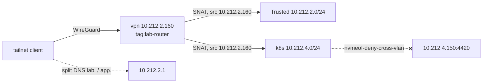

# Guests

Terraform (OpenTofu) owns what runs *on* the hosts; [machine-config](../machine-config/README.md)
owns the hosts themselves. This layer builds the core infrastructure guests.

It stops at the VM -- for Home Assistant it stops rather earlier than that;
see the trade-offs. A Talos guest boots into maintenance mode with an address
and no configuration; [cluster](../cluster/README.md) turns it into a cluster
member. No cluster secret is written here.

## Running

```sh
mise run guests plan
mise run guests apply
```

Arguments are forwarded to `tofu`, so `console`, `state list` and friends work
the same way. `init` runs automatically on first use.

## Credentials

Read out of the ansible vault by `scripts/tofu.sh` and exported, so nothing is
configured in a provider block or written to disk in cleartext:

| Variable               | Source                      | For                       |
|------------------------|-----------------------------|---------------------------|
| `PROXMOX_VE_API_TOKEN` | `secrets/proxmox-token.yml` | the node's API            |
| `UNIFI_API_KEY`        | `secrets/vault.yml`         | the guests' DNS records   |
| `TF_VAR_lab_domain`    | `secrets/vault.yml`         | endpoint and record names |
| `TF_VAR_terraform_state_passphrase` | `secrets/vault.yml` | this layer's encrypted state |

Plus **your own ssh-agent**: the provider scps cloud-init snippets, which the
upload API refuses, so an apply needs a loaded key `root@<node>` accepts
(`ssh-add -l`). Not a vault credential on purpose -- nothing extra to rotate,
and node access is already the bar for changing this layer.

If `secrets/proxmox-token.yml` is missing, rerun `mise run machine-config`:
Proxmox shows a token's secret once, so the role mints a new one. The UniFi key
is the [network](../network/README.md) layer's.

## DNS

A guest's `A` record lives in the guest's own file, through the same UniFi
provider the [network](../network/README.md) layer uses -- so adding a guest is
one file in one layer, and the record and the VM read the same local.

The split is by what owns the thing, not by kind of record: the network layer
keeps the names for what this layer does not build, the machines and the NAS.
Both write the same zone, so a name must exist in exactly one of them.

## SSH

`guest_ssh_key.tf` generates one ed25519 key for the whole layer. A guest's
cloud-init snippet authorises the public half; the private half is
written to `secrets/guests-ssh-key` (0600, gitignored) for ansible and for you:

```sh
ssh -i secrets/guests-ssh-key ubuntu@vpn.lab.<domain>
```

## Current contents

| ID   | IP           | DNS                     | Purpose                   |
|------|--------------|-------------------------|---------------------------|
| 160  | 10.212.2.160 | vpn.lab.<domain>        | tailscale subnet router   |
| 161  | 10.212.2.161 | ha.lab.<domain>         | Home Assistant OS         |
| 162  | 10.212.2.162 | pbs.lab.<domain>        | Proxmox Backup Server     |
| 4010 | 10.212.4.10  | talos-cp-1.lab.<domain> | k8s control plane, VLAN 40 |


## Known trade-offs

- **Guest ids and MACs are derived from the address.** `10.212.2.160` gives VM
  `160` and MAC `BC:24:11:00:01:60`, so a guest id, an address and a MAC all
  answer the same question. It is a convention, not a mechanism, and nothing
  enforces it.

  Guests now live in two `/24`s, which the host octet alone cannot tell apart,
  so the third octet leads the id and takes byte five of the MAC:
  `10.212.4.10` is VM `4010` and `BC:24:11:00:04:10`. vpn stays `160`,
  grandfathered. The cluster layer relies on this to read a Talos node's
  address back out of its vm id, which is the first time the convention is
  load-bearing rather than a convenience.

- **A Talos guest is tagged, and the tags are an interface.** `talos` plus
  `talos-controlplane` or `talos-worker` is how the cluster layer finds its
  nodes -- it does not keep a list. Mistyping a tag produces a VM that no
  cluster ever configures, and no error anywhere.
- **Home Assistant is an appliance, and the exception to most of this.** It is
  configured by hand afterwards since no cloud-init mechanism exists.
- **PBS is installed by hand, and deliberately so.** It ships no cloud image,
  so this layer attaches the ISO to an empty disk and stops.
- **Every image is downloaded to every node.** `local` is cluster-wide in name
  but per-node in content, and a guest can only boot from an image its own node
  holds -- so the downloads are keyed `<node>/<image>`. Wasted disk on nodes
  that never use an image, in exchange for placing a guest anywhere without
  waiting on a download.

## Backups

1. **Install.** Console on VM 162: address `10.212.2.162/24`, gateway
   `10.212.2.1`, hostname `pbs.lab.<domain>`. 20G is the operating system and
   nothing else; the backups live on the NAS.
2. **Datastore.** The `slow/pbs-backups` zvol reaches PBS over iSCSI -- see
   [machines/truenas.md](../machines/truenas.md) for the NAS half. Create
   the datastore in PBS on the mounted iSCSI drive.
4. **Token.** User `backup@pbs`, token `backup@pbs!lab`, permission
   **DatastoreBackup** on `/datastore/pbs`
5. **Storage entry.** *Datacenter* -> *Storage* -> *Add* -> *Proxmox Backup
   Server*, once for the whole cluster.
6. **Job.** *Datacenter* -> *Backup*, mode *snapshot*, notify on failure,
   fleecing on if guest disks sit on slow storage.
   **Exclude VM 162 from the job**: it cannot restore itself, and it would be
   backing up its own chunk store.

Schedules, and the order is the point -- prune has to run after the backup it
should count, and GC is the expensive one:

| Job    | Where            | Schedule                        |
|--------|------------------|---------------------------------|
| Backup | PVE, *Backup*    | `23:00` daily                   |
| Prune  | PBS, on the datastore | `04:00` daily              |
| GC     | PBS, on the datastore | `sun 05:00` weekly         |
| Verify | PBS, on the datastore | `sat 22:00` weekly, skip verified |

## VPN

VM 160 is the tailscale subnet router and exit node. The tailnet's policy and
DNS are the [network](../network/README.md#tailnet) layer's; the guest only
joins it, by hand:

1. **Auth key.** Admin console -> *Settings -> Keys*: one-off, pre-approved,
   tag `tag:lab-router`. Tagged, so the node's key never expires; the routes
   and the exit node approve themselves through the policy's `autoApprovers`.
2. **Install and join** on the guest:

   ```sh
   sudo hostnamectl set-hostname vpn   # cloud-init set it once, from the old name
   curl -fsSL https://tailscale.com/install.sh | sh
   printf 'net.ipv4.ip_forward = 1\nnet.ipv6.conf.all.forwarding = 1\n' \
     | sudo tee /etc/sysctl.d/99-tailscale.conf && sudo sysctl --system
   sudo tailscale up --auth-key=tskey-auth-... \
     --advertise-tags=tag:lab-router \
     --advertise-routes=10.212.2.0/24,10.212.4.0/24 \
     --advertise-exit-node \
     --accept-dns=false
   ```

`--accept-dns=false` because the guest already resolves through the gateway,
and split DNS would only point it back there. **Never add
`--snat-subnet-routes=false`**: the SNAT to `10.212.2.160` is what lets
`nvmeof-deny-cross-vlan` keep the tailnet off the NVMe-oF listener.


