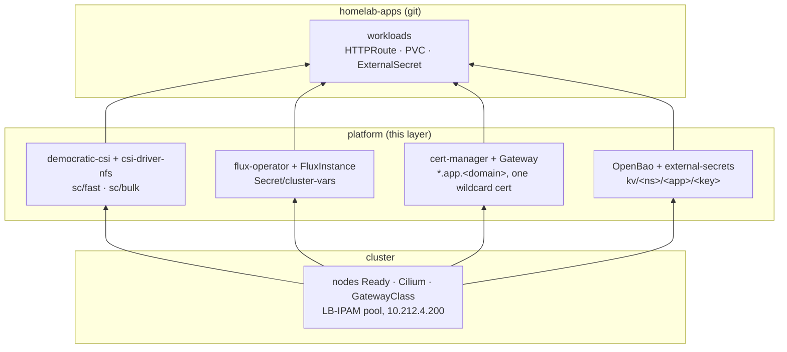

# Platform

What a workload assumes exists. [cluster](../cluster/README.md) leaves a
working but barebones Kubernetes: nodes Ready, a CNI, and an address pool. It
cannot run anything with state.

This layer adds the capabilities on top of that: storage, GitOps, the front
door and the secret store, and the same place policy will go. The line it
draws is **capability, not workload**: democratic-csi, flux, cert-manager, the
Gateway and openbao belong here. 



## Running

```sh
mise run platform plan
mise run platform apply
```

Arguments are forwarded to `tofu`. `init` runs automatically on first use.

## Credentials

Read out of the ansible vault by `scripts/tofu.sh` and exported. None is
Proxmox or UniFi -- this layer talks to the cluster, to the NAS and to OpenBao,
and to nothing else in the lab. The last three it only carries: they are
written into OpenBao and `cluster-vars` for Alertmanager, and nothing here
dials them.

| Variable                            | Source              | For                          |
|-------------------------------------|---------------------|------------------------------|
| `TF_VAR_truenas_api_key`            | `secrets/vault.yml` | democratic-csi -> TrueNAS API |
| `TF_VAR_cloudflare_api_token`       | `secrets/vault.yml` | cert-manager's DNS-01 solver  |
| `TF_VAR_terraform_state_passphrase` | `secrets/vault.yml` | this layer's encrypted state  |
| `TF_VAR_lab_domain`                 | `secrets/vault.yml` | the NAS's name                |
| `TF_VAR_app_domain`                 | `secrets/vault.yml` | what the gateway serves       |
| `TF_VAR_acme_email`                 | `secrets/vault.yml` | the Let's Encrypt account     |
| `TF_VAR_telegram_bot_token`         | `secrets/vault.yml` | Alertmanager -> Telegram      |
| `TF_VAR_telegram_chat_id`           | `secrets/vault.yml` | the group it posts into       |
| `TF_VAR_heartbeat_url`              | `secrets/vault.yml` | the `Watchdog` heartbeat      |
| `VAULT_TOKEN`                       | `secrets/vault.yml` | `bao_root_token`, configuring OpenBao |

> the terraform state is committed and encrypted.

The cluster itself is reached through `secrets/kubeconfig`, written by the
cluster layer. There is no credential for it here.

`VAULT_ADDR` is not a credential and not in the vault: `scripts/tofu.sh` opens
a port-forward to `svc/openbao` and points it at loopback. OpenBao is the one
thing here this layer configures over its own API rather than only installing.

## First install

OpenBao cannot be installed and configured in one pass -- the token that
configures it does not exist until it is running. Once per cluster:

```sh
mise run platform apply -target=helm_release.openbao
kubectl -n openbao exec -it openbao-0 -- bao operator init -format=json
mise run platform apply
```

The root token goes in `secrets/vault.yml` as `bao_root_token`. The recovery
keys go in a password manager.

## The front door

One `Gateway` on one wildcard listener behind one wildcard certificate, so
adding a hostname is an `HTTPRoute` in the apps repo and nothing here. The
address is not requested: [cluster](../cluster/README.md) holds `10.212.4.200`
in a LB-IPAM pool of one selected onto this Gateway's generated Service, and
[network](../network/README.md) points the `app.` wildcard record at it. Three
layers therefore agree on the name `Gateway/lab` in namespace `gateway`, and
nothing checks that they still do.

## Secrets

OpenBao holds them; ESO hands them out. A workload writes an `ExternalSecret`
in the apps repo naming a path, and gets a `Secret`.

**It unseals itself.** `seal "static"`, a 32-byte key from `random_bytes` in a
Secret this layer writes. The alternatives on one node with no KMS are Shamir
-- three shares typed in after every Talos upgrade -- or nothing. The key sits
next to the lock and what guards it is RBAC.

**ESO holds no credential.** It presents its own ServiceAccount token; OpenBao
validates it against the apiserver and maps it to a policy with `read` on
`kv/data/*`. PushSecret is off, so nothing here can write back.

**The values are this layer's**, mirrored from the ansible vault or generated
by tofu -- so the encrypted state is the backup, and losing the volume costs a
re-bootstrap rather than a reconstruction. `bao operator raft snapshot save`
before anything destructive.

The tree is `kv/<namespace>/<app>/<key>`, and the values all live in one file,
`platform_secrets.tf` -- so "what does this cluster hold a secret for" is one
file rather than a grep. An app's chart may be in the apps repo while its
secret is here; that is the split, not an inconsistency.

## Storage

Two drivers, two classes, and the choice between them is redundancy against
speed:

| Class  | Driver         | Pool   | Access | On the NAS                  |
|--------|----------------|--------|--------|-----------------------------|
| `fast` | democratic-csi | `fast` | RWO    | a zvol per PV, over the API |
| `bulk` | csi-driver-nfs | `slow` | RWX    | a directory per PV, in one export |

`fast` is default and is where anything latency-bound goes -- databases,
indexes, the OpenBao raft volume. It is also a single unmirrored NVMe with no
restore path, so what must survive the drive goes on `bulk`, where the mirror
and the snapshot task are.

The NAS half is built by hand and documented in [machines/truenas.md](../machines/truenas.md)

**A PVC becomes a zvol.** democratic-csi creates
`fast/k8s-csi/vols/pvc-<uuid>`, exposes it as an NVMe-oF subsystem on the
listener, and the node connects to it over TCP. Everything the driver does is
an API call -- there is no ssh to the NAS.

**Both paths stay in the cluster's own VLAN**, on the NAS's second interface at
`10.212.4.150` -- neither crosses the router, and the k8s firewall has no allow
rules left. They differ in form on purpose:

- the **API** is `https://nas-k8s.lab.<domain>`, by name, because it is
  verified against the NAS's ACME certificate -- which carries `nas` and
  `nas-k8s` as SANs. A TLS error means a missing SAN, not a reason to turn
  verification off.
- the **data path** is `10.212.4.150:4420`, by address. `nvme connect` does no
  TLS and runs on the volume-attach path -- DNS there would put a dependency
  between a pod and its disk for nothing.

### Snapshots, and the two parameters that are not the same parameter

`VolumeSnapshot` is not something Kubernetes ships, which is why
snapshot-controller is here at all: it installs the CRDs and the controller,
and without it the kind does not exist.

Underneath, democratic-csi can back a snapshot two ways, and this layer picks a
different one at each end:

|                | Snapshot (`detachedSnapshots`) | Restore (`detachedVolumesFromSnapshots`) |
|----------------|--------------------------------|-------------------------------------------|
| set to         | `false`                        | `true`                                     |
| mechanism      | `zfs snapshot`                 | `zfs send \| recv`                          |
| cost           | instant, ~0 bytes              | slow, full size                            |

Cheap snapshots so that taking one before something destructive is free.
Detached restores because the alternative is `zfs clone`, and a clone pins its
origin snapshot, which pins the source zvol: snapshot PVC-A, restore it as
PVC-B, and deleting PVC-A then fails with `filesystem has dependent clones` --
a PVC stuck in `Terminating` for a reason nothing in Kubernetes will tell you.
Paying for the restore removes that failure mode entirely, and restores are
rare where snapshots are not.

`fast/k8s-csi/snaps` is consequently empty in normal operation. It is required
configuration regardless -- the driver refuses to start without it, and refuses
if it overlaps the volumes dataset.

Neither dataset is created by hand. The driver creates everything under
`fast/k8s-csi` with `create_ancestors` on the first PVC, so the properties that
apply are the ones inherited from the pool root.

## GitOps

Flux comes in two pieces and both are here: the flux-operator chart, and the
`FluxInstance` that makes it install actual controllers. The layer ends with a
cluster pulling from git.

Two tools can then install into this cluster, split by a rule:

> **tofu owns what must exist before Flux can reconcile, plus every Secret
> whose value comes from the ansible vault. Everything else goes in git.**

`Secret/cluster-vars` is written here and substituted into the public apps repo
by each Kustomization's `postBuild` -- the domain and anything else that repo
needs and may not contain. `FluxInstance.spec.storage` is left unset on purpose,
so source-controller runs on an emptyDir rather than making Flux depend on
democratic-csi.

```sh
flux get kustomizations
kubectl -n flux-system get fluxinstance flux
```

## Known trade-offs

- **The root token is the root token.** Not a scoped one, and it lives in the
  ansible vault. TODO.
- **The seal key is next to the lock.** Deliberate: it is what makes an
  unattended reboot possible on a cluster with no KMS. RBAC on one Secret is
  the whole control, and losing the state means losing the key means the raft
  volume is unreadable.
- **ESO reads the whole tree.** One deputy, one policy: anything that can
  create an `ExternalSecret` in any namespace can read any secret. Accepted on
  the same grounds as the Gateway's `from: All`, and the path layout is
  namespaced so scoping it later is one resource rather than a migration.
- **Audit dies with the pod.** stdout, because a device that cannot write
  stops OpenBao serving entirely -- and a full data volume would be a total
  outage. There is nowhere durable to send it yet.
- **One certificate for everything.** A single wildcard, so one Secret is every
  hostname and one bad renewal is a total outage rather than one app's.
- **Capabilities here do not self-heal.** Flux reverts a hand-edited object
  within its interval; tofu notices at the next `plan`, which is whenever you
  run one.
- **One token, two consumers.** Proxmox's ACME plugin and cert-manager use the
  same `cloudflare_api_token`. Rotating it is two places that do not know about
  each other, and the symptom of missing one is certificates that quietly stop
  renewing, months later.
- **`bulk` trusts reachability, and root.** The export maps root to root
  (`no_root_squash`), because both the driver and the kubelet `chown` as root
  on that mount. Anything that can reach `10.212.4.150` from the k8s VLAN is
  therefore root on the share. Same trade as NVMe-oF beside it, over documents
  rather than VM disks.
- **`bulk` has no `VolumeSnapshotClass`.** csi-driver-nfs snapshots by writing
  a tarball into the share, which would be a second full copy inside the
  dataset the NAS already snapshots. The ZFS task on `slow/k8s-csi` is the
  mechanism, and it is not managed from here -- nothing in the cluster fails if
  someone deletes it.
- **A snapshot pins space.** Every block the live volume overwrites is held
  until the snapshot goes. On a pool the guests boot from, a forgotten
  snapshot on a write-heavy PVC is a pool-full incident. Nothing prunes them.
- **`reclaimPolicy: Delete`.** `kubectl delete pvc` destroys the data, now,
  with no undo and no backup behind it. The alternative -- `Retain` -- trades
  that for orphans nothing reaps on a pool with 500GB in it, and for a
  recreated PVC silently binding a new empty volume next to the old one.
- **The storage path has no authentication** -- no CHAP equivalent, no TLS, so
  reaching `10.212.4.150:4420` is enough to attach a volume. Only the bind
  address and one firewall policy limit that, and both have to hold; see
  network/README.md.
- **The NVMe-oF port id is hardcoded.** democratic-csi attaches subsystems to
  existing ports and does not manage them, so the id is a fact the manual
  `machines` layer produces -- and the only piece of NAS state this layer needs
  that the driver cannot make for itself. Recreate the listener and the id
  changes; the
  symptom is volumes that provision fine and then never attach, with nothing in
  the error mentioning a port.
- **Everything is single-replica.** Both controllers, because one node is its
  own failure domain and a second replica would sit pending. Raise them
  alongside the second control plane.
- **The namespace is labelled `privileged`.** The node plugin mounts the host,
  `/dev` and the host network, so Talos's default `baseline` enforcement would
  reject it. The label is the honest version of what putting it in
  `kube-system` would have done silently.
- **The apps repo publishes the topology.** Chart names and pinned versions are
  the manifests and cannot be substituted away, so what runs here and at which
  version is public even though the addresses are not.
- **Flux is pinned twice.** The chart ships the operator, `distribution.version`
  is the Flux it installs, and they track each other. Upgrading means bumping
  both together -- the cost of the README being able to say what is running.
- **No image automation.** Committing image tags back needs write access to the
  apps repo, and a public repo needing no git credential at all was worth more.
  Versions move when a commit moves them.
